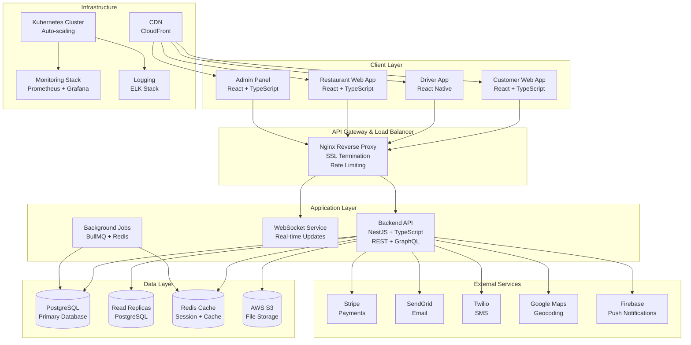
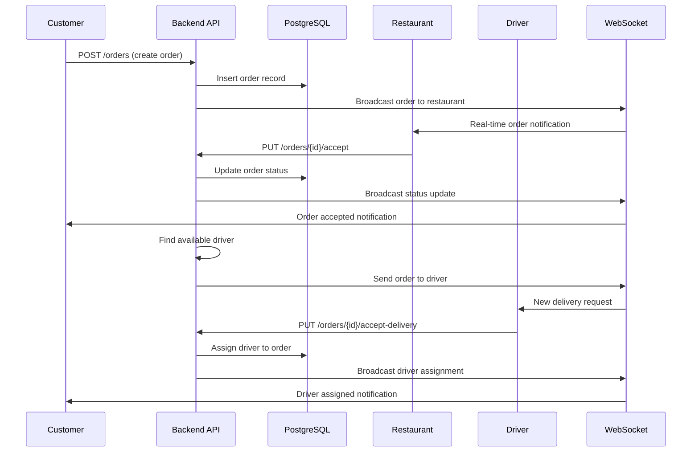
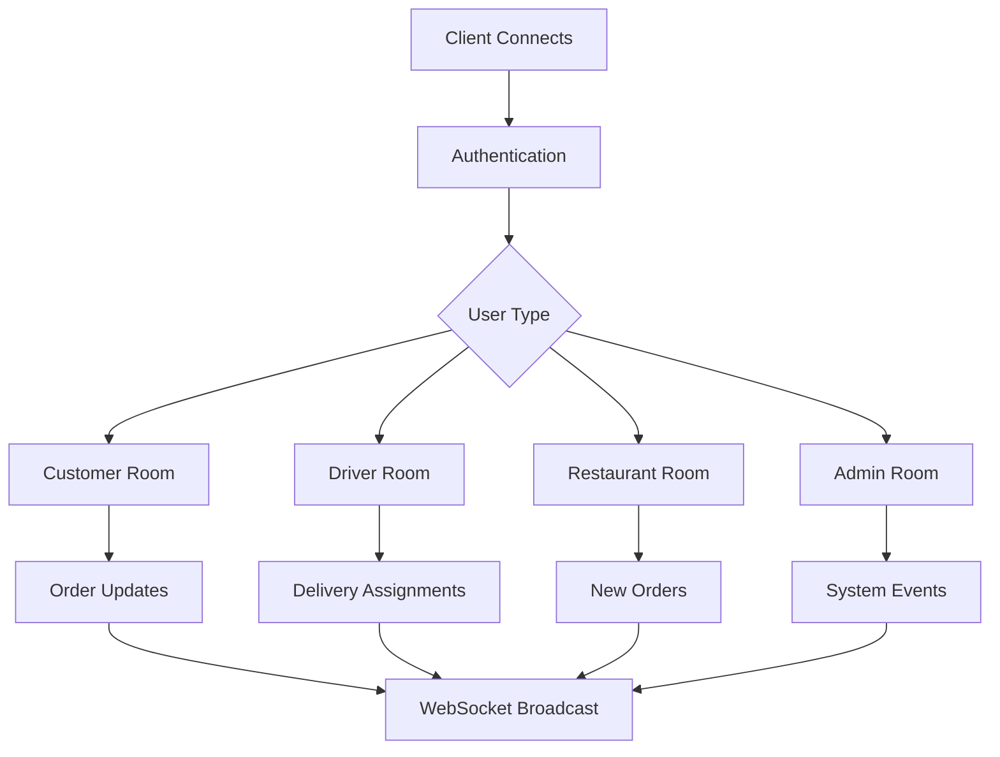

# UberFoods System Architecture Overview

## 🏗️ System Architecture

UberFoods is a comprehensive food delivery platform built with modern technologies and enterprise-grade architecture. This document provides a complete overview of the system architecture, components, and design decisions.

## 📊 High-Level Architecture

## 🏛️ Architecture Components

### Frontend Applications

#### Customer Web App
- **Framework**: React 18 + TypeScript
- **State Management**: Redux Toolkit + React Query
- **Routing**: React Router v6
- **UI Library**: Tailwind CSS + shadcn/ui
- **Features**:
  - Restaurant browsing and search
  - Menu display and ordering
  - Real-time order tracking
  - User profile management
  - Loyalty program integration
  - Group ordering functionality

#### Driver Mobile App
- **Framework**: React Native 0.72.6 + Expo SDK 49
- **State Management**: Redux Toolkit + React Query
- **Navigation**: React Navigation v6
- **Features**:
  - Real-time GPS tracking
  - Order management and status updates
  - Earnings tracking
  - Route optimization
  - Push notifications

#### Restaurant Web App
- **Framework**: React 18 + TypeScript
- **State Management**: Redux Toolkit + React Query
- **UI Library**: Material-UI + Custom Components
- **Features**:
  - Order management dashboard
  - Menu management system
  - Real-time order notifications
  - Analytics and reporting
  - Kitchen display system integration

#### Admin Panel
- **Framework**: React 18 + TypeScript
- **State Management**: Redux Toolkit + React Query
- **Charts**: Recharts + D3.js
- **Features**:
  - System-wide monitoring
  - User and restaurant management
  - Financial reporting
  - Content moderation
  - System configuration

### Backend Services

#### API Server (NestJS)
- **Framework**: NestJS + TypeScript
- **Database ORM**: Prisma
- **Authentication**: JWT + Passport
- **Validation**: class-validator + class-transformer
- **Documentation**: Swagger/OpenAPI
- **Features**:
  - RESTful API endpoints
  - GraphQL API (future)
  - WebSocket integration
  - Background job processing
  - File upload handling
  - Email and SMS services

#### WebSocket Service
- **Library**: Socket.IO
- **Features**:
  - Real-time order updates
  - Driver location tracking
  - Restaurant notifications
  - Customer order status

#### Background Jobs
- **Queue System**: BullMQ + Redis
- **Features**:
  - Order processing
  - Email/SMS notifications
  - Data synchronization
  - Analytics processing
  - Scheduled tasks (cron jobs)

### Data Layer

#### PostgreSQL Database
- **Version**: PostgreSQL 15
- **Extensions**: PostGIS, pg_stat_statements, pg_buffercache
- **Architecture**:
  - Primary database for writes
  - Read replicas for queries
  - Automated backups
  - Connection pooling (PgBouncer)

#### Redis Cache
- **Use Cases**:
  - Session storage
  - API response caching
  - Rate limiting
  - Real-time data (leaderboards, active orders)
  - Background job queues

#### AWS S3 Storage
- **Use Cases**:
  - Restaurant images
  - Menu item photos
  - User profile pictures
  - Order receipts
  - Backup storage

### External Integrations

#### Payment Processing
- **Provider**: Stripe
- **Features**:
  - Credit card processing
  - Digital wallets (Apple Pay, Google Pay)
  - Subscription management
  - Dispute handling

#### Communication
- **Email**: SendGrid
- **SMS**: Twilio
- **Push Notifications**: Firebase Cloud Messaging

#### Maps & Location
- **Provider**: Google Maps Platform
- **Features**:
  - Address geocoding
  - Route optimization
  - Distance calculations
  - Location-based search

### Infrastructure

#### Kubernetes Cluster
- **Platform**: Amazon EKS / Google GKE / Azure AKS
- **Features**:
  - Auto-scaling (HPA/VPA)
  - Rolling deployments
  - Secrets management
  - Network policies
  - Resource quotas

#### Monitoring Stack
- **Metrics**: Prometheus
- **Visualization**: Grafana
- **Alerting**: AlertManager
- **Logging**: ELK Stack (Elasticsearch, Logstash, Kibana)

#### CDN & Edge Computing
- **Provider**: AWS CloudFront / CloudFlare
- **Features**:
  - Global content delivery
  - SSL termination
  - DDoS protection
  - Image optimization

## 🔄 Data Flow Architecture

### Order Creation Flow

### Real-time Communication Flow

## 🛡️ Security Architecture

### Authentication & Authorization
- **JWT Tokens**: Stateless authentication with refresh tokens
- **Role-Based Access Control**: Customer, Driver, Restaurant, Admin roles
- **API Keys**: For server-to-server communication
- **Multi-Factor Authentication**: Optional for high-security accounts

### Data Protection
- **Encryption**: Data encrypted at rest and in transit
- **Secrets Management**: Kubernetes secrets with rotation
- **API Security**: Rate limiting, input validation, CORS
- **GDPR Compliance**: Data deletion, consent management, audit logs

### Network Security
- **SSL/TLS**: End-to-end encryption
- **Web Application Firewall**: Protection against common attacks
- **Network Segmentation**: Isolated service networks
- **Zero Trust**: Every request authenticated and authorized

## 📈 Scalability Design

### Horizontal Scaling
- **Application Layer**: Stateless services, multiple replicas
- **Database Layer**: Read replicas, sharding support
- **Cache Layer**: Redis cluster for high availability
- **Storage Layer**: CDN for global content delivery

### Performance Optimizations
- **Database**: Indexing, query optimization, connection pooling
- **Caching**: Multi-layer caching strategy (CDN → Redis → Application)
- **Assets**: Code splitting, lazy loading, compression
- **API**: Pagination, efficient serialization, background processing

### Auto-scaling Policies
- **CPU/Memory**: Scale based on resource utilization
- **Requests per Second**: Scale based on traffic patterns
- **Queue Depth**: Scale background workers based on job queue
- **Custom Metrics**: Scale based on business KPIs

## 🔧 Development & Deployment

### CI/CD Pipeline

```mermaid
graph LR
    A[Code Commit] --> B[Automated Tests]
    B --> C[Security Scan]
    C --> D[Build Docker Images]
    D --> E[Deploy to Staging]
    E --> F[Integration Tests]
    F --> G[Performance Tests]
    G --> H[Manual Approval]
    H --> I[Deploy to Production]
    I --> J[Post-deployment Tests]
    J --> K[Monitoring & Alerts]
```

### Environment Strategy
- **Development**: Local development with hot reload
- **Staging**: Full production-like environment for testing
- **Production**: Multi-region deployment with blue-green strategy
- **Disaster Recovery**: Cross-region failover capability

### Configuration Management
- **Environment Variables**: Sensitive configuration
- **ConfigMaps**: Non-sensitive configuration
- **Secrets**: Encrypted sensitive data
- **GitOps**: Infrastructure as code with version control

## 📊 Monitoring & Observability

### Metrics Collection
- **Application Metrics**: Response times, error rates, throughput
- **System Metrics**: CPU, memory, disk, network
- **Business Metrics**: Orders, revenue, user engagement
- **Custom Metrics**: Feature usage, performance indicators

### Logging Strategy
- **Structured Logging**: JSON format with consistent schema
- **Log Levels**: ERROR, WARN, INFO, DEBUG
- **Log Aggregation**: Centralized logging with search capabilities
- **Retention Policy**: Configurable retention periods

### Alerting Strategy
- **Critical Alerts**: System downtime, data loss, security breaches
- **Warning Alerts**: Performance degradation, high resource usage
- **Informational**: Deployment notifications, maintenance windows
- **Escalation Policy**: Automated escalation based on severity

## 🚀 Future Enhancements

### Planned Features
- **AI/ML Integration**: Personalized recommendations, dynamic pricing
- **IoT Integration**: Smart kitchen equipment, delivery drones
- **AR Features**: Augmented reality for menu browsing
- **Voice Ordering**: Alexa/Google Home integration
- **Blockchain**: Transparent transaction tracking

### Technology Upgrades
- **GraphQL Migration**: More efficient API queries
- **Microservices Split**: Independent service deployment
- **Event Sourcing**: Better audit trails and analytics
- **Serverless Functions**: Cost-effective background processing

---

**Last Updated**: December 4, 2025
**Version**: 1.0.0
**Status**: Production Ready
